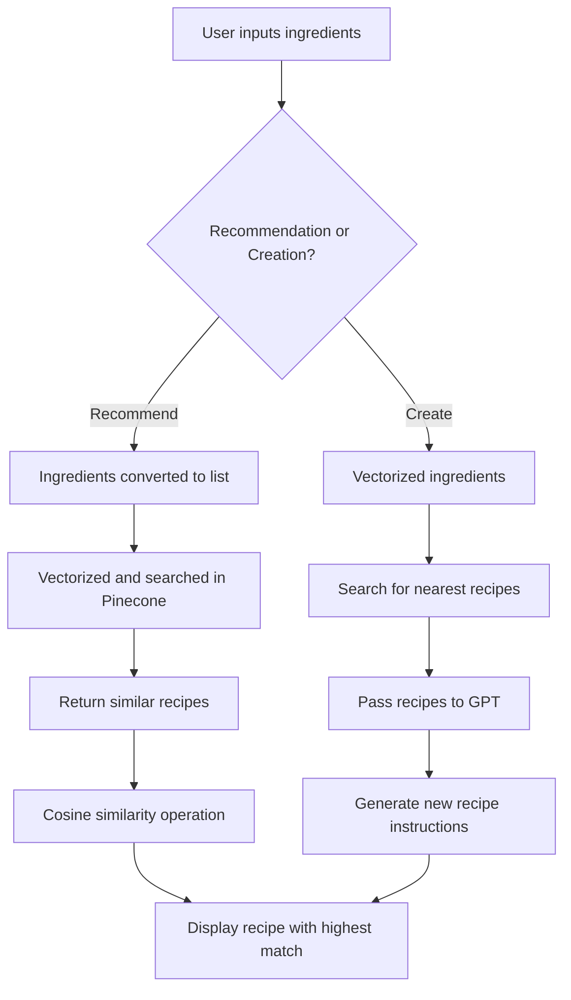

# AICook: Intelligent Recipe Assistant

AICook is an intelligent recipe assistant that allows users to find recipes based on the ingredients they have available, as well as create new recipes tailored to their needs. The project leverages advanced machine learning models and vector databases to provide personalized recipe suggestions. Additionally, the project is designed to help food companies implement new language models into their recipe collections, enabling them to enhance their services.

<div align="center">

</div>

---

## Table of Contents

- [Introduction](#introduction)
- [Objectives](#objectives)
- [Features](#features)
- [Project Structure](#project-structure)
- [Setup and Installation](#setup-and-installation)
- [How to Use](#how-to-use)
- [Technical Overview](#technical-overview)
- [Workflow](#workflow)
- [Customization Options](#customization-options)
- [Limitations and Challenges](#limitations-and-challenges)
- [Future Enhancements](#future-enhancements)
- [Contributing](#contributing)
- [License](#license)

---

## Introduction

AICook is a recipe recommendation and creation service that helps users find recipes based on their available ingredients and specific needs. It is designed for both individual users looking for cooking inspiration and companies in the food industry seeking to incorporate language models into their recipe management systems. AICook makes use of vector embeddings and natural language generation to recommend existing recipes or create entirely new ones, enhancing creativity in the kitchen.

---

## Objectives

1. **Personalized Recipe Recommendations**: Users can input a list of available ingredients, and AICook will return the closest matching recipes using a vector-based search.
   
2. **New Recipe Creation**: AICook generates new, creative recipes by combining ingredients and GPT-generated instructions.

3. **Business Application**: AICook offers food companies a way to implement new language models into their recipe systems, improving user engagement and expanding recipe possibilities.

---

## Features

- **Recipe Recommendation**: Based on user-provided ingredients, AICook recommends existing recipes that match closely with what the user has at hand.
  
- **Recipe Creation**: Generates entirely new recipes using user-supplied ingredients, combining them with existing recipes to inspire creativity in the kitchen.
  
- **Backend with Flask**: Powers the core logic for processing user inputs, performing vector searches, and generating recipe instructions.
  
- **Frontend with React**: A modern and intuitive user interface that allows users to input ingredients, request recipes, and view results seamlessly.

- **Advanced Recipe Matching**: Uses cosine similarity to find the best recipe matches by comparing user ingredients with a large dataset of recipes stored as vector embeddings.

- **Efficient Search Using Pinecone**: AICook uses the Pinecone vector database for fast and efficient recipe retrieval.

<div align="center">

</div>

---

## Project Structure

```bash
AICook-Intelligent-Recipe-Assistant/
│
├── src/
│   ├── app.py              # Flask backend script
│   ├── recommend_recipes.py # Recipe recommendation logic
│   ├── create_recipes.py    # Recipe creation logic
│   ├── helpers.py           # Helper functions and utilities
│
├── frontend/               # React frontend for user interface
│   ├── public/             # Static files (HTML, icons)
│   ├── src/                # React components and logic
│   └── package.json        # React dependencies
│
├── data/                   # Directory to store recipe datasets (handled externally)
│   └── recipes.parquet      # Recipe data (external storage: S3, Google Drive, etc.)
│
├── assets/                 # UI assets (logo, images)
│   └── logo.png             # Application logo
│
├── .env                    # Environment variables (API keys, Pinecone credentials)
├── README.md               # Project README
└── requirements.txt        # Required dependencies
```

---

## Setup and Installation

### Prerequisites

- Python 3.8+
- Node.js (for the React frontend)
- Pinecone account with API key (for vector database storage)
- GPT API Key (for natural language recipe generation)

### Installation

1. Clone the repository:
   ```bash
   git clone https://github.com/LuisHRF/AICook-Intelligent-Recipe-Assistant.git
   cd AICook-Intelligent-Recipe-Assistant
   ```

2. Install required dependencies for the backend:
   ```bash
   pip install -r requirements.txt
   ```

3. Install required dependencies for the frontend:
   ```bash
   cd frontend
   npm install
   ```

4. Set up environment variables:
   - Create a `.env` file in the root directory and include your API keys as follows:
     ```bash
     PINECONE_API_KEY=your_pinecone_api_key
     GPT_API_KEY=your_gpt_api_key
     ```

5. External Data Storage:
   - The large recipe datasets (`recipes.parquet`) are stored in external storage (S3, Google Drive, etc.). Use the provided script to download them upon project initialization.

---

## How to Use

### Running the Application

1. Start the Flask backend:
   ```bash
   python src/app.py
   ```

2. Start the React frontend:
   ```bash
   cd frontend
   npm start
   ```

3. Open your web browser and navigate to `http://localhost:3000` to start interacting with AICook.

### Main Functionalities

- **Recommend Recipes**: Input a list of ingredients, and AICook will return the closest matching recipe based on ingredient similarity.
  
- **Create New Recipes**: Input a list of ingredients, and AICook will generate a new recipe by combining ingredients with similar recipes and creating a unique set of instructions using GPT.

---

## Technical Overview

- **Vector Database (Pinecone)**: Recipes are stored as vector embeddings in Pinecone. Each embedding has 384 dimensions, which are generated using the `SentenceTransformer` model. These embeddings represent the ingredients of a recipe, and metadata (recipe ID, name, ingredients, instructions, and total time) is attached for efficient retrieval.

- **Cosine Similarity**: When a user inputs ingredients, AICook searches the vector database using cosine similarity to find the recipe most similar to the provided ingredients.

- **GPT for Recipe Creation**: When creating a new recipe, AICook leverages GPT to generate detailed cooking instructions by referencing the steps from similar recipes in the database.

- **React Frontend**: Provides a smooth user experience, allowing users to input ingredients, view recommended or created recipes, and interact with the system in real-time.

---

## Workflow

Below is the general workflow for the two core functionalities: recipe recommendation and recipe creation.



---

## Customization Options

- **UI Enhancements**: Customize the React frontend with additional themes, such as night mode or different layouts, to improve the user experience.
  
- **Storage Flexibility**: The recipe dataset is stored externally due to its size. However, you can adjust the storage options by integrating with S3, Google Drive, or similar services to manage large datasets.

---

## Limitations and Challenges

- **Pinecone Free Version**: Due to the free version of Pinecone, there were limitations in updating the vector database and performing large-scale vectorizations. Expanding the logic to handle more recipes and ensuring efficient retrieval under a premium version would improve scalability.
  
- **Vector Database**: Building the vector database from scratch presented challenges, especially with embedding large recipe datasets and ensuring accurate recipe retrieval.

---

## Future Enhancements

- **Improved Vector Logic**: Enhance the logic for vector embeddings to improve recipe matching and overall search efficiency.
  
- **Expand Recipe Database**: Add more recipes to the database to improve variety and coverage, making the recommendations more versatile.
  
- **Business Model Expansion**: Offer API integration for food companies to leverage AICook’s recommendation and creation systems in their own recipe collections.
  
- **User Account Features**: Allow users to save their favorite recipes and search history.

---

## Contributing

Contributions are welcome! If you'd like to contribute to AICook, please follow these steps:

1. Fork the repository.
2. Create a new branch (`git checkout -b feature-branch`).
3. Commit your changes (`git commit -m 'Add some feature'`).
4. Push to the branch (`git push origin feature-branch`).
5. Create a new Pull Request.

---

## License

This project is licensed under the MIT License - see the [LICENSE](https://github.com/LuisHRF/AICook-Intelligent-Recipe-Assistant/blob/main/LICENSE) file for details.

---

### Contact

For any inquiries or feedback, feel free to reach out via GitHub Issues or contact me directly at [LuisHRF GitHub](https://github.com/LuisHRF).

